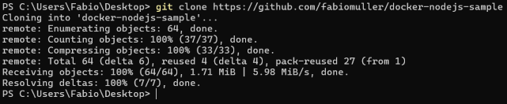
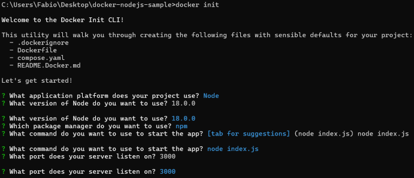
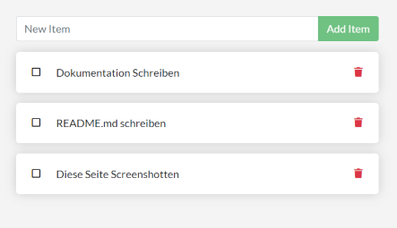

# **Installation des Projekts**

### **Klonen des Repositories**

  Um ein Repositorie zu klonen muss man den Link zum gewünsten Repositorie kopieren und im Terminal mit ```git clone```  und dem entsprechenden Link herunterladen.

  

### **Installation der notwendigen Pakete**

  Bei der Anwedung der Applikation werden noch Dateien gebarucht. Als Anwender muss man diese nicht einzel installieren. Mit dem Befehl ```docker init``` werden die notwendigen Dateien automatisch installiert:
  ```dockerignore```
  ```Dockerfile```
  ```compose.yaml```
  ```README.Docker.md```

  Ausserdem werden mit dem Befehl auch diese wichtigen Pakete installiert, die wichtig für den Betrieb der Applikation sind:
  ```express```
  ```pg```
  ```sqlite3```
  ```uuid```
  ```wait-port```

  Wichtig fürs entwickeln im Docker-Container sind diese Pakete:
  ```jest```
  ```nodemon```
  ```prettier```

  Credits: Benni's ChatGPT

### **Docker-Konfiguration und -Installation**

  Mit dem Command ```docker init``` kann man die Datei so konfigurieren, wie mann sie haben will.
  Für diese Applikation sollte man die Folgenden Einstllungen machen.

  What application platform does your project use? Node
  What version of Node do you want to use? 18.0.0
  Which package manager do you want to use? npm
  What command do you want to use to start the app: node src/index.js
  What port does your server listen on? 3000

  

### **Starten der Applikation in einem Docker-Container**

  Mit dem Command ```docker compose up --build``` kann die Applikation gestartet werden und über den [Lokalen Host](http://localhost:3000/)
  angezeigt werden.

  Um die Applikation in Hintergrund laufen zu lassen einfach```docker compose down``` im Terminal eingeben.

  

  In der Applikation können nur To-Do's eingetragen, abgehackt und gelöscht werden.

  
